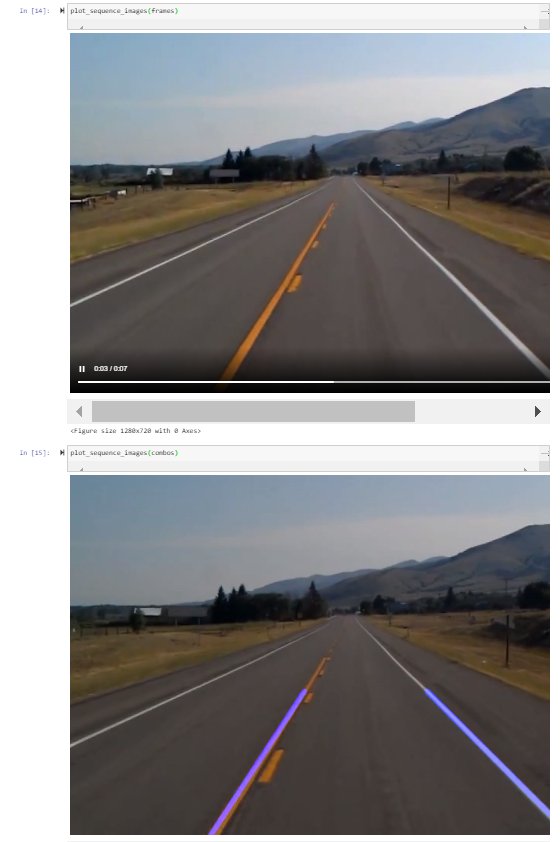

# OpenCV Lane Detection

## Original implementation

[OpenCV Real time road lane detection](https://www.geeksforgeeks.org/opencv-real-time-road-lane-detection/)

## Requirements

* docker: [Install Docker](https://docs.docker.com/get-docker/)
* docker-compose: [Install docker-compose](https://docs.docker.com/compose/install/)

## How to run

1. Clone this repo: `git clone https://github.com/cevan1835/opencv_lane_detection`
3. Run `bin.sh` and wait until Jupyter Notebook up (usually when blue text appear on terminal)
4. Browse `http://localhost:8888/notebooks/lane_detection.ipynb`
5. Click on Menu -> Cell -> Run All

## Output

